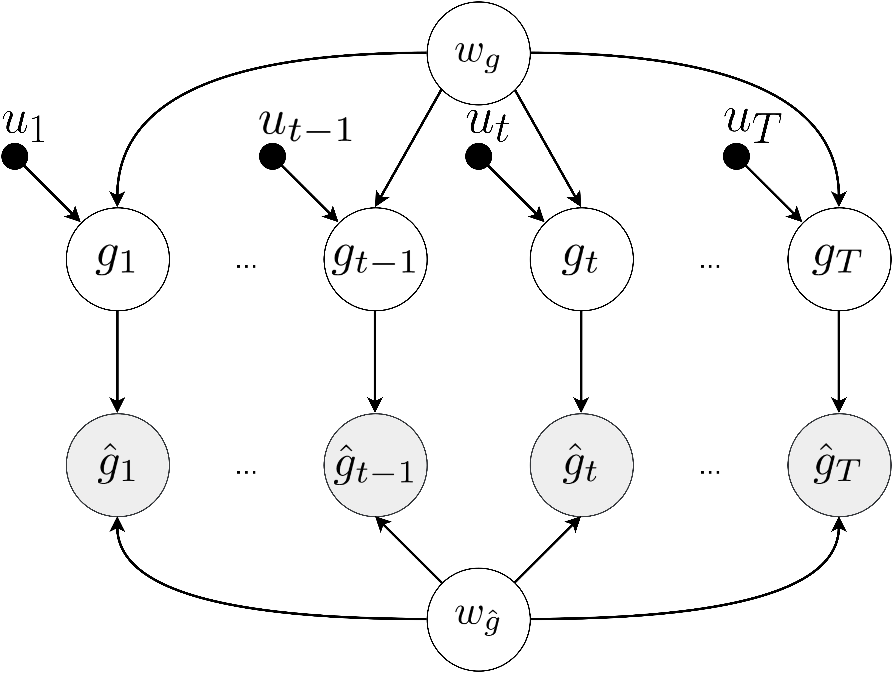

## Variational Stochastic Gradient Descent for Deep Neural Networks

This repository contains the source code accompanying the paper:

 [Variational Stochastic Gradient Descent for Deep Neural Networks]()  
 <br/> [[Demos]](https://github.com/generativeai-tue/vsgd/blob/main/notebooks) 
 <!-- [[Slides (TBA)]]()  -->
 <br/>**[Haotian Chen\*](https://www.linkedin.com/in/haotian-chen-359b4520b/), [Anna Kuzina\*](https://akuzina.github.io/), [Babak Esmaeili](https://babak0032.github.io), & [Jakub M. Tomczak](https://jmtomczak.github.io/)**.


#### Abstract
*Optimizing deep neural networks (DNNs) is one of the main tasks in successful deep learning. Current state-of-the-art optimizers are adaptive gradient-based optimization methods such as Adam. Recently, there has been an increasing interest in formulating gradient-based optimizers in a probabilistic framework for better estimation of gradients and modeling uncertainties. Here, we propose to combine both approaches, resulting in the Variational Stochastic Gradient Descent (VSGD) optimizer. We model gradient updates as a probabilistic model and utilize stochastic variational inference (SVI) to derive an efficient and effective update rule. Further, we show how our VSGD method relates to other adaptive gradient-based optimizers like Adam. 
Lastly, we carry out experiments on two image classification datasets and three deep neural network architectures, where we show that  VSGD converges faster and outperforms Adam and SGD.*


  

### Repository structure

#### Folders

This repository is organized as follows:

* `src` contains the main PyTorch library
* `configs` contains the default configuration for `src/run_experiment.py`
* `notebooks` contains a demo of using VSGD optimizer


----
### Reproduce

###### Install conda *(recommended)*

```bash
conda env create -f environment.yml
conda activate vsgd
```

###### Login wandb *(recommended)*
```bash
wandb login 
```

###### Download TinyImagenet dataset

```bash
cd data/
wget http://cs231n.stanford.edu/tiny-imagenet-200.zip
unzip tiny-imagenet-200.zip 
```

###### Starting an experiment
All the experiments are run with `src/run_experiment.py`. Experiment configuration is handled by [Hydra](https://hydra.cc), one can find default configuration in the `configs/` folder. 

`configs/experiment/` contains configs for dataset-architecture pairs. For example, to train VGG model on cifar100 dataset with VSGD optimizer, run:
```bash
PYTHONPATH=src/ python src/run_experiment.py experiment=cifar100_vgg  train/optimizer=vsgd 
```

One can also change any default hyperparameters using the command line:
```bash
PYTHONPATH=src/ python src/run_experiment.py experiment=cifar100_vgg  train/optimizer=vsgd train.optimizer.weight_decay=0.01 
```


----

### Cite
If you found this work useful in your research, please consider citing:

```
@article{
    chen2024variational,
    title={Variational Stochastic Gradient Descent for Deep Neural Networks},
    author={Chen, Haotian and Kuzina, Anna and Esmaeili, Babak and Tomczak, Jakub},
    year={2024},
}
```

### Acknowledgements
*Anna Kuzina is funded by the Hybrid Intelligence Center, a 10-year programme funded by the Dutch Ministry of Education, Culture and Science through the Netherlands Organisation for Scientific Research, https://hybrid-intelligence-centre.nl.
This work was carried out on the Dutch national e-infrastructure with the support of SURF Cooperative.*

